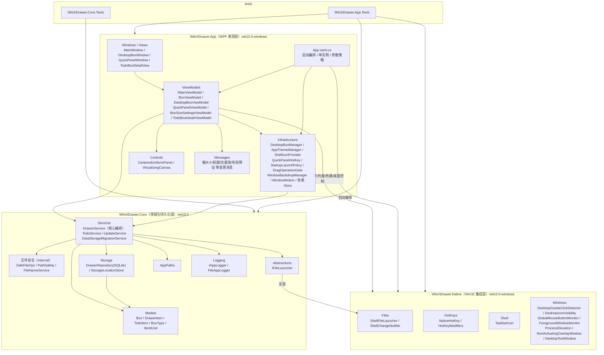
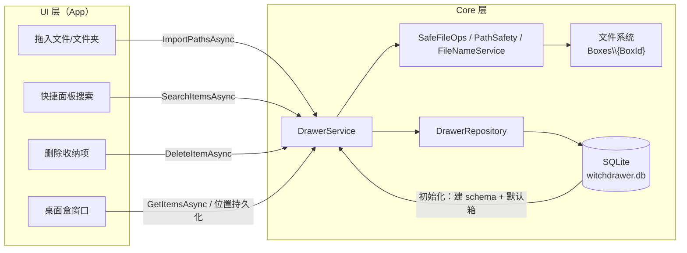
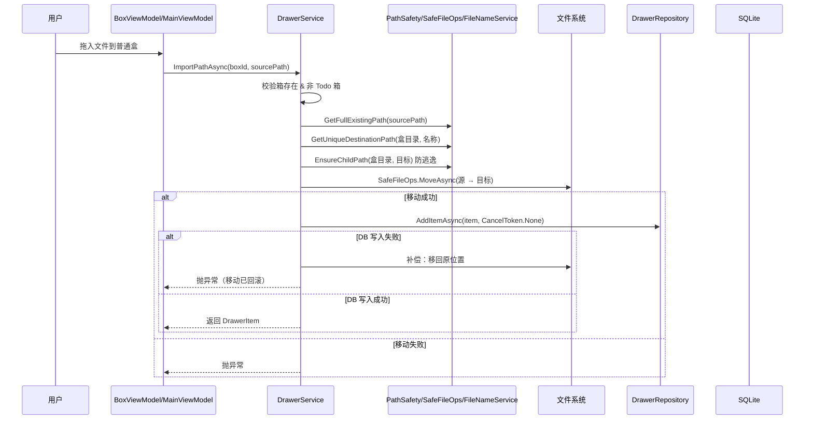
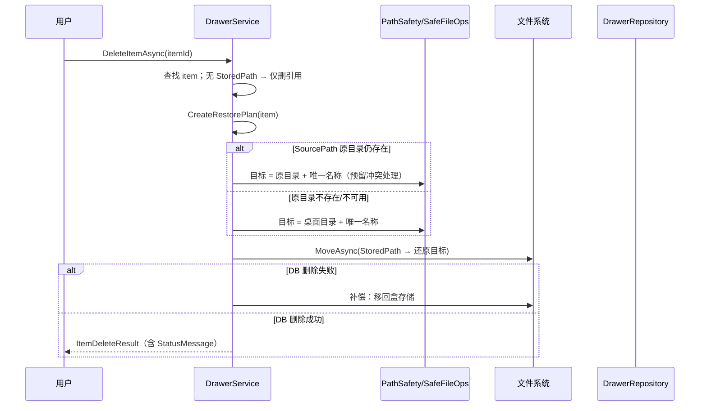

# WitchDrawer 架构文档

> 本文档基于对 `src/`、`tests/` 全部源码的遍历逆向整理，用于描述系统整体架构、分层职责、数据流与关键业务流程。
> 变更记录见文末；与代码不一致时以代码为准，并请同步更新本文档。

## 1. 系统概览

WitchDrawer 是一款基于**原生 WPF** 构建的 Windows 桌面文件收纳工具（.NET 10）。用户将常用文件/文件夹拖入桌面上的小收纳盒，即可快速打开与整理，让临时工作资料井然有序。

| 属性 | 值 |
|------|-----|
| 运行时 | .NET 10（`global.json` 锁定 SDK 10.0.300） |
| UI 框架 | WPF（`net10.0-windows`），禁止 Electron/WebView |
| 持久化 | SQLite（WAL 模式），数据库 `%LocalAppData%\WitchDrawer\witchdrawer.db` |
| MVVM | CommunityToolkit.Mvvm 8.4.2 |
| 原生集成 | Win32 API（Shell 打开、全局快捷键、系统托盘、桌面图标控制） |
| 单元测试 | xUnit（Core.Tests / App.Tests 两个项目） |
| 文件存储 | 普通/像素/抽屉盒：`%LocalAppData%\WitchDrawer\Boxes\{BoxId}`；映射盒仅存引用 |

## 2. 分层架构图



**依赖方向**：`App → Core`、`App → Native`、`Native → Core`（Native 引用 Core 的 `IFileLauncher` 抽象与模型）。Core 不依赖任何 UI/Win32 类型，保证核心逻辑可独立测试。

## 3. 项目依赖图

```mermaid
graph LR
    APP["WitchDrawer.App<br/>(WinExe)"] --> CORE["WitchDrawer.Core"]
    APP --> NATIVE["WitchDrawer.Native"]
    NATIVE --> CORE
    APP_T["WitchDrawer.App.Tests"] --> APP
    APP_T --> CORE
    APP_T --> NATIVE
    CORE_T["WitchDrawer.Core.Tests"] --> CORE

    CORE -.CommunityToolkit.Mvvm 8.4.2.-> APP
    CORE -.Microsoft.Data.Sqlite.Core 10.0.8<br/>SQLitePCLRaw.bundle_winsqlite3 2.1.11.-> CORE
```

## 4. 模块职责

### 4.1 WitchDrawer.Core（领域与持久化层）

| 模块 | 关键类型 | 职责 |
|------|----------|------|
| 模型 | `Box`（Normal/Mapping/Pixel/Todo/Drawer 五种类型）、`DrawerItem`（File/Directory）、`TodoItem` | 领域数据模型，均为不可变 record |
| 编排服务 | `DrawerService` | 唯一文件变更入口：建箱/重命名/排序、导入、跨箱移动、导出、删除还原、搜索、设置读写 |
| Todo 服务 | `TodoService` | Todo 盒待办：增删、完成/取消、归档/恢复（标题上限 200 字符） |
| 更新服务 | `UpdateService` | 检查 GitHub Releases、下载安装包、SHA-256 校验、构建升级脚本 |
| 迁移服务 | `DataStorageMigrationService` | 数据目录迁移（含旧版本目录识别与复制） |
| 文件安全 | `SafeFileOps` / `PathSafety` / `FileNameService` | 同卷 rename、跨卷 copy-then-delete；路径防逃逸（拒绝重解析点）；重名加 ` (1)`、` (2)` 后缀 |
| 仓储 | `DrawerRepository` | SQLite 全部读写（Box/Item/Todo/Setting），WAL 模式 |
| 存储位置 | `StorageLocationStore` | 自定义数据目录（`storage-location.json`） |
| 抽象 | `IFileLauncher` | 文件打开抽象，由 Native 实现 |
| 路径 | `AppPaths` | 数据目录布局（Boxes/、logs/、witchdrawer.db），支持 `WITCHDRAWER_DATA_DIR` 环境变量覆盖 |
| 日志 | `IAppLogger` / `FileAppLogger` | 文件日志 |

### 4.2 WitchDrawer.Native（Win32 集成层）

| 模块 | 关键类型 | 职责 |
|------|----------|------|
| Shell 打开 | `ShellFileLauncher : IFileLauncher` | 通过 Shell 打开文件/文件夹 |
| 变更通知 | `ShellChangeNotifier` | `SHChangeNotify` 通知资源管理器刷新 |
| 全局快捷键 | `NativeHotKey` / `HotKeyModifiers` | `RegisterHotKey`/`UnregisterHotKey` 包装（快捷面板 Ctrl+Alt+W） |
| 系统托盘 | `TaskbarIcon` | Shell_NotifyIcon 托盘图标与上下文菜单 |
| 桌面控制 | `DesktopIconVisibility` | 隐藏/显示 Windows 桌面图标；双击桌面空白判定 |
| 鼠标监控 | `GlobalMouseButtonMonitor` / `DesktopDoubleClickDetector` | 全局鼠标钩子、桌面双击检测（需提权场景） |
| 窗口工具 | `NonActivatingOverlayWindow` / `DesktopToolWindow` / `ForegroundWindowMonitor` | 非激活悬浮窗、桌面工具窗、前台窗口跟踪 |
| 提权 | `ProcessElevation` | 检测提权状态并以非提权方式重启 |
| 快捷方式迁移 | `StartupShortcutMigration` | 开机自启快捷方式迁移 |

### 4.3 WitchDrawer.App（WPF 表现层）

| 模块 | 关键类型 | 职责 |
|------|----------|------|
| 启动 | `App.xaml.cs` | 启动编排：单实例、参数策略（静默启动/激活已有实例）、组合根 |
| 窗口 | `MainWindow` / `DesktopBoxWindow` / `QuickPanelWindow` / `TodoBoxDetailView` | 主窗口、桌面收纳盒浮动窗、快捷面板、Todo 详情 |
| 视图模型 | `MainViewModel`、`BoxViewModel`、`DesktopBoxViewModel`、`QuickPanelViewModel`、`BoxSizeSettingsViewModel`、`TodoBoxDetailViewModel` | 各界面状态与命令 |
| 桌面窗管理 | `DesktopBoxManager` | 收纳盒窗口的创建、定位、分层、恢复、全部显示/关闭 |
| 主题 | `AppThemeManager` / `AppTheme` | 三套主题（清透雅致/玻璃光泽/水晶棱镜），Mica 等背景效果 |
| 图标 | `ShellIconProvider` / `DeferredIconLoad` | 系统原生图标提取（异步、DPi 感知） |
| 快捷键 | `QuickPanelHotKey` / `QuickPanelHotKeySettingsStore` | 快捷面板快捷键的可配置化与序列化 |
| 拖放 | `DragOperationGate` | 拖放操作闸门（防抖/合法性校验） |
| 排序 | `DrawerItemSortMode` / `ResettableObservableCollection` | 收纳项排序与集合重置 |
| 转换器 | `InverseBooleanToVisibilityConverter` 等 | WPF 绑定转换器 |

## 5. 数据流



### 5.1 关键路径说明

- **启动**：`App.xaml.cs` → `DrawerService.InitializeAsync`：创建数据目录 → 初始化 SQLite schema → `RepairStoredPathsAsync` 修复存储路径 → 空库时创建默认「普通收纳盒」「映射收纳盒」。
- **拖入普通盒**：校验源路径存在 → 计算目标唯一路径 → 同卷 rename / 跨卷 copy-delete 移入 `Boxes\{BoxId}` → 写 `DrawerItem`（`StoredPath` 指向盒内文件，`SourcePath` 记录原位置）。DB 写失败时**补偿回滚**文件移动。
- **拖入映射盒**：只存 `SourcePath` 绝对引用，源文件不动。
- **删除普通盒项**：优先还原到原目录；原目录不可用则回退桌面；重名自动加后缀。DB 写失败时把文件移回盒内。
- **删除收纳盒**：逐项还原（失败项计入 `Failures`），全部成功才移除盒记录；映射盒/Todo 盒直接删引用。
- **快捷面板**：`Ctrl+Alt+W` → 全局热键消息 → 从 SQLite 加载全部项 → 内存过滤搜索（< 200 ms 预算）。
- **文件修剪**：读取列表时对 `StoredPath` 已不存在的项做惰性清理；**存储根不可达（移动盘掉线）时绝不清理**，避免误删记录。

## 6. 关键业务流程时序图

### 6.1 拖入普通收纳盒（含补偿回滚）



### 6.2 删除普通盒项（原位还原 + 桌面回退）



## 7. 存储布局与数据模型

```text
%LocalAppData%\WitchDrawer\            （可用 WITCHDRAWER_DATA_DIR 覆盖；可迁移）
├── witchdrawer.db                     SQLite（WAL）
├── Boxes\
│   └── {BoxId:N}\                     普通/像素/抽屉盒的文件实际存储
└── logs\
    └── app.log                        运行日志
```

核心表实体（由 `DrawerRepository` 维护）：

| 实体 | 关键字段 | 说明 |
|------|----------|------|
| `Box` | Id(Guid)、Name、Type、StoragePath、SortOrder、CreatedAt、UpdatedAt | Type: Normal=0/Mapping=1/Pixel=2/Todo=3/Drawer=4 |
| `DrawerItem` | Id、BoxId、DisplayName、ItemKind(File/Directory)、SourcePath、StoredPath、SortOrder、GridColumn/GridRow、时间戳 | `EffectivePath = StoredPath ?? SourcePath` |
| `TodoItem` | Id、BoxId、Title、IsCompleted、SortOrder、CompletedAt、IsArchived、ArchivedAt | |
| `Setting` | Key/Value | 键值设置（主题、热键、图标大小等） |

## 8. 非功能约束（工程纪律）

| 类别 | 约束 |
|------|------|
| 性能 | UI 线程禁止文件 IO / SQLite 写入 / 图标提取；列表必须虚拟化；快捷面板热键唤起 < 200 ms；空闲 CPU ≈ 0%；空闲内存 < 150 MB（可行时）；120Hz 动画按 8.33 ms 帧预算 |
| 文件安全 | 所有文件变更必须经 `DrawerService` → `SafeFileOps`；目标路径必须 `EnsureChildPath` 校验且拒绝重解析点；重名统一 ` (1)`/` (2)` 后缀；跨卷自动 copy-then-delete |
| 测试纪律 | 涉及文件移动/重名/删除/持久化/搜索的改动必须配套测试；交付前 `dotnet build` 与 `dotnet test` 必须通过 |

## 9. 构建与验证

```powershell
dotnet build WitchDrawer.sln      # 构建
dotnet test WitchDrawer.sln       # 测试
.\build.ps1                        # Release 构建
.\dev.ps1                          # Debug 构建并启动
```

## 10. 变更记录

| 日期 | 变更内容 |
|------|----------|
| 2026-08-13 | 基于源码遍历重写：新增分层架构图、项目依赖图、数据流图、关键流程时序图、模块职责表、数据模型表 |
